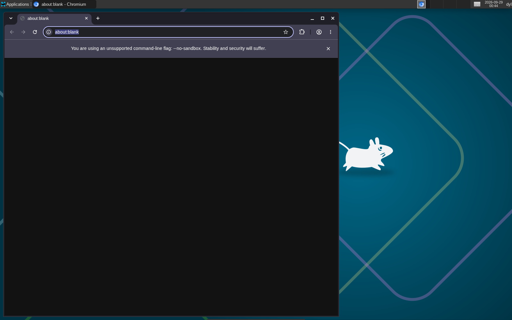
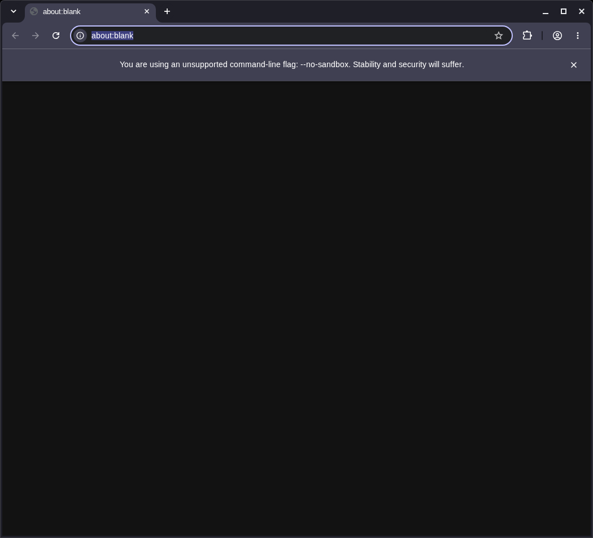
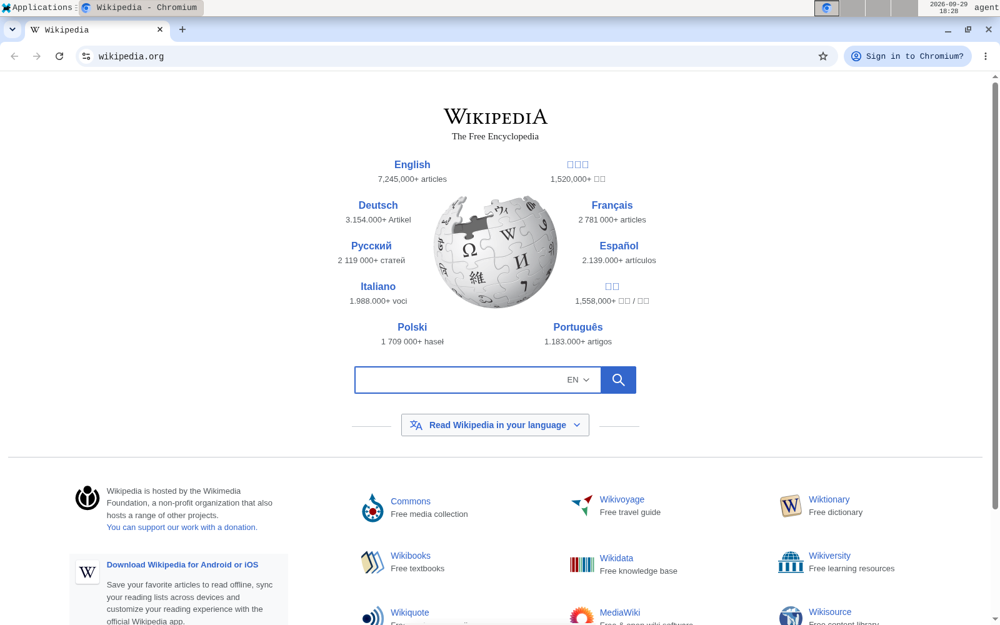

# Cloud computer use agents

Reusable agent skills and Linux examples for driving browsers and desktop apps while keeping a person's interactive desktop separate.

## Included

- `.agents/skills/computer-use/`: choose the right control interface, target the intended desktop, and verify what the user can see.
- `.agents/skills/record/`: capture short, reviewable screenshots and videos of a workflow.
- `.agents/skills/agentbox/`: route each agent's GUI, browser, terminal, and recordings to its own Linux microVM.
- `docs/isolated-linux-desktop.md`: run a private Xvfb and XFCE desktop for computer-use tasks while the physical desktop stays locked or in use.
- `docs/agentbox.md`: create per-agent Microsandbox desktops with independent Chromium profiles cloned from a dedicated sign-in seed.
- `examples/linux/`: a user service and session launcher for that isolated desktop.

The skills use the `SKILL.md` format. Agent discovery paths differ, so `scripts/install-skills.sh` creates symlinks for common user-level locations. It keeps existing files and links intact.

## Screenshots

The isolated Linux desktop runs XFCE under Xvfb, with Chromium available for browser tasks. It stays separate from the laptop's interactive desktop.







## Verification videos

- [Isolated desktop launch and browser navigation (21.5 seconds)](assets/videos/agentbox-cua-workflow.mp4)
- [CUA MCP browser interaction (6 seconds)](assets/videos/agentbox-mcp-verification.mp4)

## Install the skills

Clone the repo and run the installer:

```sh
git clone https://github.com/dyl-joseph/cloud-computer-use-agents.git
cd cloud-computer-use-agents
./scripts/install-skills.sh
```

The script installs links under `~/.agents/skills`, `~/.claude/skills`, `~/.codex/skills`, and `~/.config/opencode/skills`. Pass a home directory as the first argument to install into a different home, such as a test directory. Restart the agent after installation if its skill list does not refresh.

If a skill with the same name already exists at a destination, the script leaves it alone and reports the conflict. Back up or remove that skill yourself before rerunning the installer to replace it.

## Use CUA Driver

These skills provide workflows, not a GUI runtime. Install and configure a computer-use driver separately. For CUA Driver, start with its [official docs](https://cua.ai/docs/cua-driver) and [upstream repository](https://github.com/trycua/cua). Its platform-specific skill contains the current tool commands; the Linux guide here covers the separate Xvfb desktop setup.

For one VM per agent, use [Agentbox](docs/agentbox.md). Each VM has its own guest kernel, Chromium profile, XFCE desktop, CUA socket, workspace, and recordings. Connect through `agentbox mcp <id>` and route terminal commands through the same ID. The single-user systemd/Xvfb setup remains available in the Linux guide.

## Skill locations and references

- [OpenAI skill format](https://developers.openai.com/api/docs/guides/tools-skills)
- [Claude Code skill locations](https://code.claude.com/docs/en/skills)
- [OpenCode skill locations](https://opencode.ai/docs/skills/)
- [OpenAI Codex skill examples](https://developers.openai.com/blog/eval-skills)
